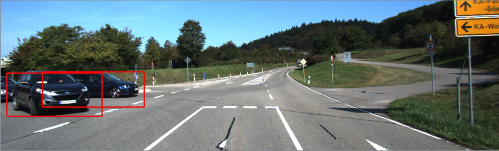

# TF-SSD-VehicleDetection
Vehicle Detection with SSD algorithm and Tensorflow

Some Setups:

Single Shot Detection: [https://arxiv.org/abs/1512.02325](https://arxiv.org/abs/1512.02325)

TensorFlow Version: 1.4

Python: 3.6 (Anaconda3)

**Notice:**

My trained models and logs can be download from Google Drive [https://drive.google.com/open?id=1_IpPGwND0D0HPCJ9zNAKAInv5J5GaB2g](https://drive.google.com/open?id=1_IpPGwND0D0HPCJ9zNAKAInv5J5GaB2g)

#### (1) Download and unzip KITTI dataset

 Specifically, you only need download 3 files:

 - [Download left color images of object data set (12 GB)](http://www.cvlibs.net/download.php?file=data_object_image_2.zip)

 - [Download training labels of object data set (5 MB)](http://www.cvlibs.net/download.php?file=data_object_label_2.zip)

 - [Download object development kit (1 MB)](http://kitti.is.tue.mpg.de/kitti/devkit_object.zip)

#### (2) Run trainer.py for training you model

 please adjust some configurations yourself, such as learning rate, batchsize and so on.

#### (3) Run tester.py for testing you model  

